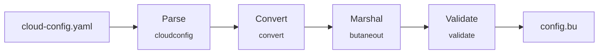
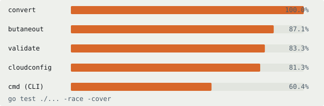
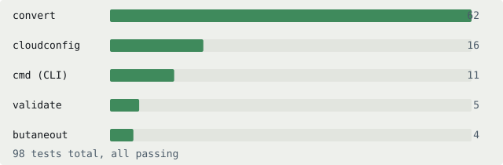
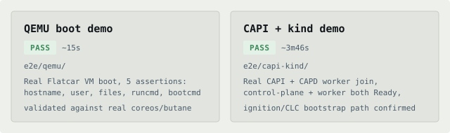

# cloud-config2butane

A Go transpiler that converts cloud-config YAML into Butane YAML for
[Flatcar](https://www.flatcar.org/). Flatcar provisions via Butane and
Ignition, but much of the ecosystem it needs to interoperate with  including
kubeadm-generated bootstrap data  still only speaks cloud-config. This tool
bridges that gap.

Scope is deliberately narrow: the minimum Butane feature set needed for
ClusterAPI worker node provisioning  users, groups, SSH keys, files,
certificates, and systemd units. See
[SUPPORTED_FIELDS.md](SUPPORTED_FIELDS.md) for exactly which cloud-config
fields are handled and how, [OUTSCOPE.md](OUTSCOPE.md) for what's
explicitly out of scope, and
[PROBLEMS_AND_SOLUTIONS.md](PROBLEMS_AND_SOLUTIONS.md) for the real
issues hit while building the demos and how they were fixed.

This is the implementation for an
[LFX Mentorship](https://github.com/flatcar/Flatcar/issues/2226) proposal.

## Status



Every stage above is a real package boundary: `cloudconfig.Parse` hands a
typed `Config` to `convert.Convert`, which hands a Butane config to
`butaneout.Marshal`, and the result is checked against the real
`coreos/butane` library before anything is written out.

**Test coverage**  `go test ./... -race -cover`, 98 tests, all passing:



**Tests per package:**



## Install / build

Requires Go (see `go.mod` for the minimum version).

```sh
go install github.com/AdityaShome/cloud-config2butane/cmd/cloud-config2butane@latest
```

Or build from a local checkout:

```sh
git clone https://github.com/AdityaShome/cloud-config2butane.git
cd cloud-config2butane
go build -o cloud-config2butane ./cmd/cloud-config2butane
```

## Quickstart

```sh
cloud-config2butane -in cloud-config.yaml -out config.bu
```

By default the generated Butane is also validated against the real
[`coreos/butane`](https://github.com/coreos/butane) library before being
written out  if real Butane would reject the output, the CLI fails instead of
writing a broken file. Skip that check with `-validate=false`.

Flags:

| Flag | Default | Meaning |
|---|---|---|
| `-in` | *(required)* | Path to the cloud-config YAML input. |
| `-out` | stdout | Path to write the generated Butane YAML. |
| `-validate` | `true` | Validate the generated config against the real `coreos/butane` library. |
| `-json` | `false` | On failure, print errors as a JSON array instead of plain text. |

A cloud-config file with several problems reports all of them in one pass,
not just the first:

```sh
$ cloud-config2butane -in broken.yaml
converting broken.yaml:
user: missing name
user bob: passwd must be a hashed password (e.g. $6$...), got a plaintext value
```

## Development

```sh
go build ./...
go vet ./...
go test ./... -race -cover
gofmt -l .
```

`testdata/golden/` holds one directory per feature (`input.yaml` /
`expected.bu`), each run through the full `Parse -> Convert -> Marshal`
pipeline and checked against real Butane by the test suite  see
`internal/convert/golden_test.go`.

## Demos

Two end-to-end demos, both reproducible from a clean checkout (see each
directory's README for prerequisites). Both passing, from real runs:



- [`e2e/qemu/`](e2e/qemu/)  boots a real Flatcar VM from this tool's
  generated config and asserts it actually applied (user, files, runcmd,
  bootcmd).
- [`e2e/capi-kind/`](e2e/capi-kind/)  a CAPI + kind + Docker-provider
  cluster where the worker joins via CAPI's native ignition bootstrap
  path. See that README for an important scope note on what this does and
  doesn't prove about this tool's own output.

Each demo has an [asciinema](https://asciinema.org) recording of a real,
passing run under `recording/demo.cast`  play with `asciinema play
<file>`.
